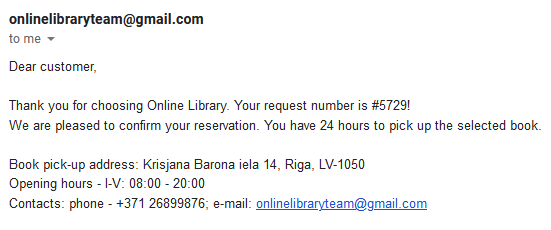

# Online Library - Manual testing log
___
___
## User profile testing
___
### Registration tests
* Registration of new user with valid details
* Registration of new user with invalid details

Successful tests:
* Registration of new user with valid details
* Registration of new user with invalid details:
    * First name can't be blank
    * Last name can't be blank
    * Email can't be blank
    * Email format must be correct
    * Email must be unique (not in the database)
    * Password must be at least 6 characters
___
### Login tests
* Log in with existing user and correct details
* Log in with non-existing user or incorrect details

Successful tests:
* Log in with existing user and correct details
* Log in with incorrect details:
    * Unable to log in with invalid email
    * Unable to log in with invalid password
    * Unable to log in with invalid email and password
    * Unable to log in with non-existing user
___
### Homepage tests
* Go to books page
* Logout

Successful tests:
* Go to books page
* Logout
___
### Books page tests
* Checking search functions
* Open specific book page
* Make reservation for specific book

Successful tests:
* Checking search functions:
    * works when using complete words
* Open specific book page
* Make reservation for a specific book:
    * If quantity of books is at least 1 reservation option is possible
    * If quantity of books 0 reservation option is not possible
    * If reservation was successful user receives email with reservation details

Bugs:
* Checking search functions:
    * when using short combinations of letters might display too many results

___
___
## Administrator profile testing

### Login tests
* Log in with existing user and correct details
* Log in with incorrect details

Successful tests:
* Log in with existing user and correct details
* Log in with incorrect details:
    * Unable to log in with invalid email
    * Unable to log in with invalid password
    * Unable to log in with invalid email and password
___
### Homepage tests
* Go to books page
* Go to users page
* Go to authors page
* Go to genres page
* Logout

Successful tests:
* Go to books page
* Go to users page
* Go to authors page
* Go to genres page
* Logout
___
### Books page tests
* Checking search functions
* Open specific book
* Make reservation for specific book
* Create a book with valid details
* Create a book with invalid details
* Edit a book with valid details
* Edit a book with invalid details

Successful tests:
* Checking search functions:
    * works when using complete words
* Open specific book
* Make reservation for a specific book:
    * If quantity of books is at least 1 reservation option is possible
    * If quantity of books 0 reservation option is not possible
    * If reservation was successful user receives email with reservation details
* Create a book with valid details
* Create a book with invalid details:
    * Title can't be blank
    * Amount of pages has to be at least 1
    * Description can't be blank
* Edit a book with valid details
* Edit a book with invalid details:
    * Title can't be blank
    * Amount of pages has to be at least 1
    * Description can't be blank

Bugs:
* Checking search functions:
    * when using short combinations of letters might display too many results
* Create a book with invalid details:
    * If pages or quantity fields are manually deleted and "Create new Book" button is pressed an unexpected input validation error is shown
* Edit a book with invalid details:
    * If pages or quantity fields are manually deleted and "Update Book" button is pressed an unexpected input validation error is shown
___
### Users page tests
* Checking search functions
* Create a user with valid details
* Create a user with invalid details
* Edit a user with valid details
* Edit a user with invalid details
* Delete a user

Successful tests:
* Checking search functions
* Create a user with valid details
* Create a user with invalid details:
    * First name can't be blank
    * Last name can't be blank
    * Email can't be blank
    * Email format must be correct
    * Email must be unique (not in the database)
    * Password must be at least 6 characters
* Edit a user with valid details
* Edit a user with invalid details:
    * First name can't be blank
    * Last name can't be blank
    * Email can't be blank
    * Email format must be correct
    * Email must be unique (not in the database)
    * Password must be at least 6 characters
* Delete a user

Bugs:
* Create a user with valid details:
    * When trying to repeatedly create a user that does not meet input validation webpage will gives error
* Edit a user with invalid details:
    * When trying to repeatedly update a user that does not meet input validation webpage will gives error
___
### Authors page tests
* Checking search functions
* Create an author with valid details
* Create an author with invalid details
* Edit an author with valid details
* Edit an author with invalid details
* Delete an author

Successful tests:
* Checking search functions
* Create an author with valid details
* Create an author with invalid details:
    * First name can't be blank
    * Last name can't be blank
* Edit an author with valid details
* Edit an author with invalid details:
    * First name can't be blank
    * Last name can't be blank
* Delete an author
___
### Genres page tests
* Checking search functions
* Create a genre with valid details
* Create a genre with invalid details
* Edit a genre with valid details
* Edit a genre with invalid details
* Delete a genre

Successful tests:
* Checking search functions
* Create a genre with valid details
* Create a genre with invalid details:
    * Genre name can't be blank
* Edit a genre with valid details
* Edit a genre with invalid details:
    * Genre name can't be blank
* Delete a genre
___
___
## Cross-class test
Steps of test:
* Registration of new user with valid details
* Create an author with valid details using administrator user
* Create a genre with valid details using administrator user
* Create a book with valid details using administrator user
* Make reservation for the new book with the new user
* Expecting email confirmation to the new user

Result of test - email confirmation received as expected

